# sync_gps_lidar_imu_cam
## 简介
**lidar-imu-cam-GPS时间戳硬件同步方案:** 此方案使用GPS设备输出的PPS信号与GPRMC数据实现多传感器的时间同步, 其中PPS信号用于矫正不同设备时钟的计时偏差, GPRMC数据用于给定统一时间戳;

**1.GPS接收器:** "华测610"设备, 原始GPS信号接收频率为5Hz, 经内部算法与IMU设备融合可输出最高100Hz的定位数据;  
　　　　　　*其中输出数据使用RS232协议, 包括**A口、C口**两个主要输出端口;  
　　　　　　*A口输出PPS信号(引脚8)和GPRMC数据(引脚2); C口输出组合导航数据GPCHC.

**2.lidar:** Velodyne 16线, 使用官网驱动, 理论上适配velodyne的其他多线雷达.  
　　　*驱动中仅使用lidar返回的"分-秒及以下数据", 对于"时"及以上信息由ROS时间给定, 因此需要保证电脑时间联网同步为UTC时间.

**3.IMU:** Xsens Mti-300, 为Mti-100系列产品, 理论上适用10/100系列产品.  
　　　*驱动程序略作修改, 使用串口接收GPRMC数据, 对IMU时间戳进行绝对时间赋值, 修改文件为main.cpp.  
　　　*硬件上同时将PPS接到SyncIn和ClockBias上. 参考: https://github.com/ZhuangYanDLUT/hard_sync_dut.git.

**4.相机:** 使用两个单目pointgrey的灰度相机组成双目相机, 使用IMU输出信号作为触发进行数据采集.  
　　　*其中驱动部分略作修改, 使用IMU触发时间作为相机图像的采集时间, 修改文件为pointgrey_camera_driver/src/stereo_nodelet.cpp.  
　　　*为实现固定频率采集, 需要固定快门速度, 1-3ms时图像亮度适中, 4ms及以上则图像中心开始产生亮斑.  
　　　*硬件上, 触发线与IMU的SyncOut相连. 

* 注: 以上时间统一为带时区的UTC时间(北京时间), 其中GPS-C口数据为GPS周秒时间, 目前与UTC时间相差18s整; 

## 硬件连接方案

## 参考资料
1. GPS同步IMU: https://github.com/ZhuangYanDLUT/hard_sync_dut.git.
2. IMU触发相机: (驱动修改)https://github.com/TurtleZhong/Visual-Inertial-Synchronization-Hardware/blob/670409690b592d364e6c179a74981bfcdd920ced/pointgrey_camera_driver/pointgrey_camera_driver/src/nodelet.cpp
3. 串口程序: 调用ROS的serial实现.